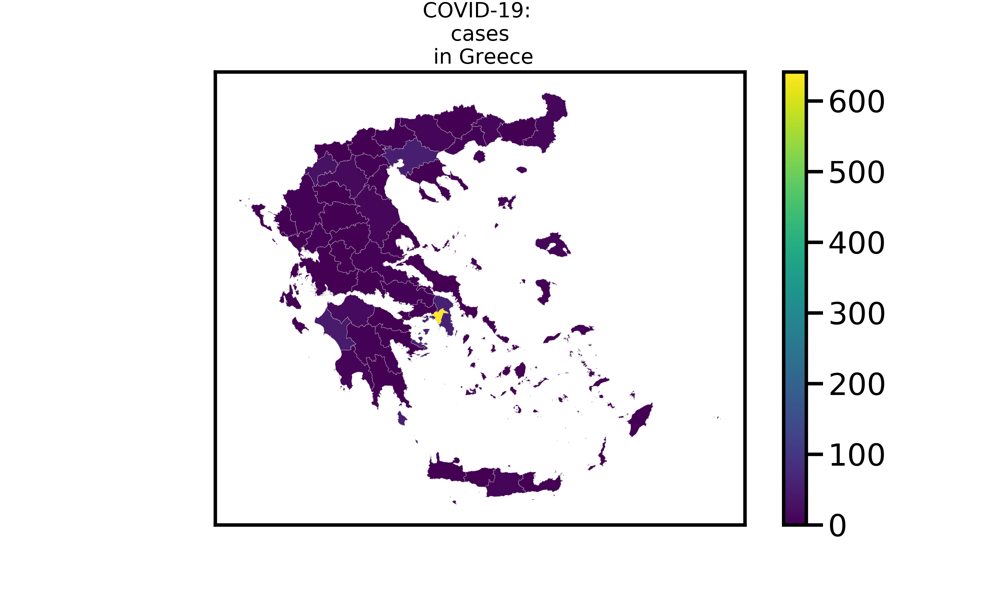

# Datasets and analysis of Novel Coronavirus (COVID-19) outbreak in Greece

This repository provides datasets regarding the COVID-19 outbreak in Greece. Our goals are to:
* Conduct data analysis
* Create visualizations
* Develop tracking tools

## How to contribute

This project is performed by volunteers of [COVID-19 Response Greece](https://www.covid19response.gr). We are looking for new volunteers and fresh ideas! Feel free to contribute by adding your analysis and visualizations.

## Data sources
*Data are updated 3 times a day using Github Actions*

* Johns Hopkins CSSE: https://systems.jhu.edu/research/public-health/ncov
  * Data repository: https://github.com/CSSEGISandData/COVID-19
  
* World Health Organization (WHO): https://www.who.int/

* National Public Health Organization (NPHO) of Greece: https://eody.gov.gr/

* Wikipedia: https://el.wikipedia.org/wiki/Πανδημία_του_κορονοϊού_στην_Ελλάδα_το_2020

* isMOOD covid19 Greece: https://covid19live.ismood.com/

  ( [+ suggest a data source!](mailto:alex.delitzas@gmail.com) )

## Folder Structure

```bash
.
├── data
│   ├── greece             # data for Greece
│   └── all_countries      # data for all countries worldwide (for comparison purposes)
├── data-processing        # scripts for data processing and cleaning
├── analysis               # scripts and notebooks for data analysis
└── visualizations         # visualization outputs
```

## Data visualizations

* Choropleth Map: COVID-19 outbreak in Greece


