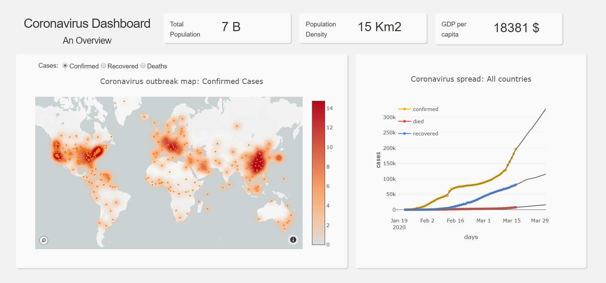

# The Coronavirus Dashboard: An overview 

This is a repository for the interactive dashboard that visualizes and forecasts the coronavirus spread in different countries and regions. 

The dataset is provided by the Data Repository of Johns Hopkins Center for Systems Science and Engineering (JHU CSSE). The datasets for the confirmed and recovered cases such as the deaths are used. You can find the dataset here https://github.com/CSSEGISandData/COVID-19. You do not need to download the datasets from the repository the codes works with the latest updated datasets from that repository. 

In the screenshot below, a printsceen of the dashboard is displayed: 

The main <strong>functionalities</strong> are:  

<strong> 1) Density heat map: </strong>
The world heat map, on the left side of the dashboard, illustrates the spread of the virus. The darker it is, the more cases reported in that area. The user can select from the menu above the heat map the cases to be displayed.  

<strong> 2) Cases Forecast: </strong>
The user can select a country or a region on the heat map, and then on the right side of the dashboard can see the spread of the virus in that country or region. 
The displayed data shows the confirmed, death and recovered cases throughout the time for the selected area. The graph displays the actual data and the predictions for about the 10 next days. Prophet is used to forecast the cases. 

<strong> 2) General Info: </strong>
For each selected country or region, the user can see some general information about the country or the region such as population, population density, and GDP per capita. 

### Instructions:

Download the folder, run the app.py file and open your local host: http://127.0.0.1:80/

app.py : the main function  
layout.py: the layout of the app 
callbacks.py: the callbacks of the app 
app_functions.py all the required apps  
assets folders: the CSS styling of the app 
population_statistics.csv: includes statistics of the world population 
